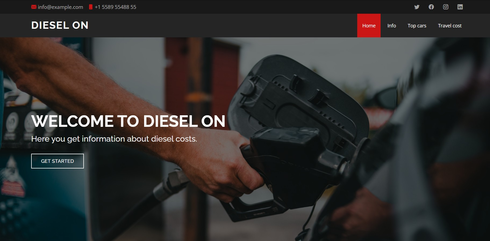
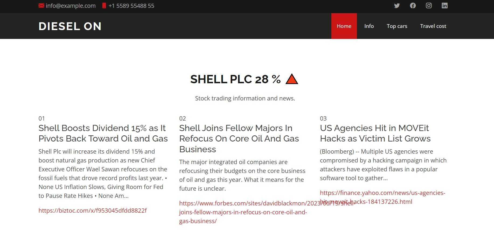
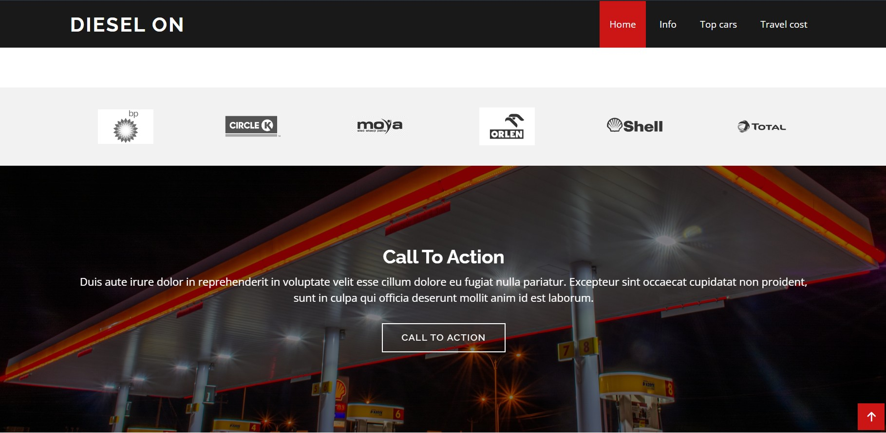
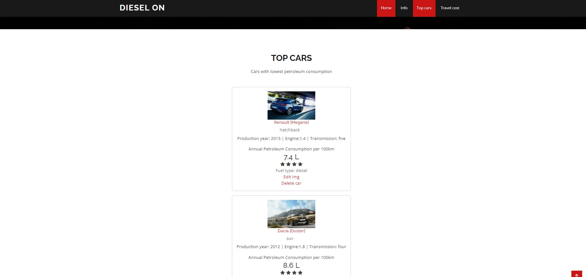
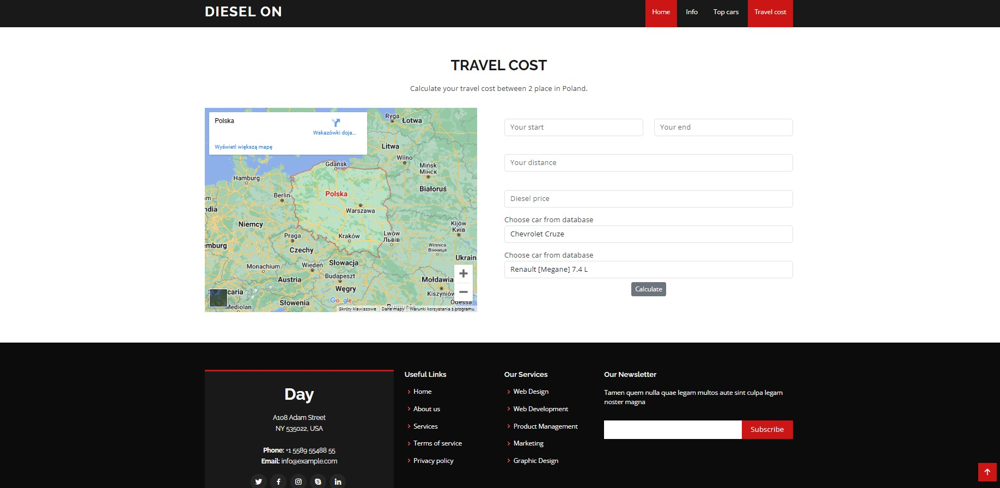

# Diesel_API

This web application provides a wide range of information about diesel
and costs associated with it. User can follow current diesel price trends, he can compare prices at gas station of different companies. Moreover user can calculate a monthly cost of driving a diesel car. In addition, he can compare cars with the lowest fuel consumption.

## Table of Contents

* [General Info](#general-information)
* [Technologies Used](#technologies-used)
* [Features](#features)
* [Previews](#Previews)
* [Setup](#setup)
* [Project Status](#project-status)
* [Room for Improvement](#room-for-improvement)
* [Contact](#contact)
* [License](#license)

## General Information

The main reason why I created this web application was that I wanted to know about a margin of our national diesel supplier. Therefore I use API request to get information about actual USD/PL' exchange rate.
Moreover I can calculate my monthly journeys, when I use a diesel car.

This application was created using Flask and SQLlite database.

## Technologies Used

- Python - version 3.11
- Bootstrap - version 5.2.3
- Flask - version 2.2.2
- SQLAlchemy - version 1.4.45
- WTForms - version  3.0.1
- PostgreSQL database

## Features

List the ready features here:

- On home Page User can follow current diesel price trends
- User can register account and login
- When user log in, he gets an access to adding car journeys and calculate cost of these journeys.

## Previews

### Home Page

### Section 1 - Stock trading information using API

### Section 2 - Gas station

### Section 3 - Car database with CRUD operations

### Section 4 - Travel cost calculator with cars from database

## Setup

- Clone This Project git clone
- Enter Project Directory cd Disiel_API
- Create a Virtual Environment (for Windows) py -m venv (name your virtual enviroment :) venv

'EXAMPLE: py -m venv venv'

- Activate Virtual Environment source: venv/Scripts/activate
- Install Requirements Package pip install -r requirements.txt
- Finally Run The Project: python app.py

## Project Status

Project is: _in progress_

## Room for Improvement

Room for improvement:

- Login and registering user with authentication
- Registered users can calculate and save travel cost in database
- Webscraping google maps to get distance between 2 cities in Poland

To do:

- add login/register routes
- create model to keep information about travel
- use Selenium to get distance beetween 2 cities in Poland

## Contac

- Created by [@RockPiryt Github](https://github.com/RockPiryt)
- My Resume [@RockPiryt Resume](https://rockpiryt.github.io/Personal_Site/)

Feel free to contact me!

## License

This project is open source and available under the [MIT License]
